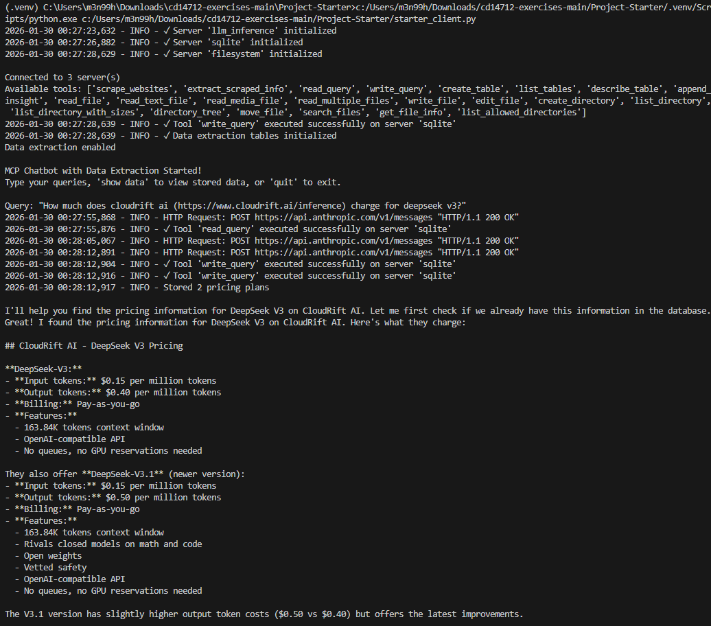
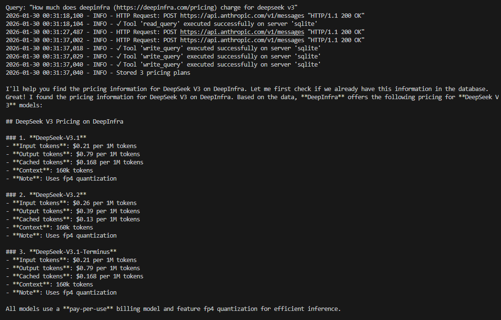
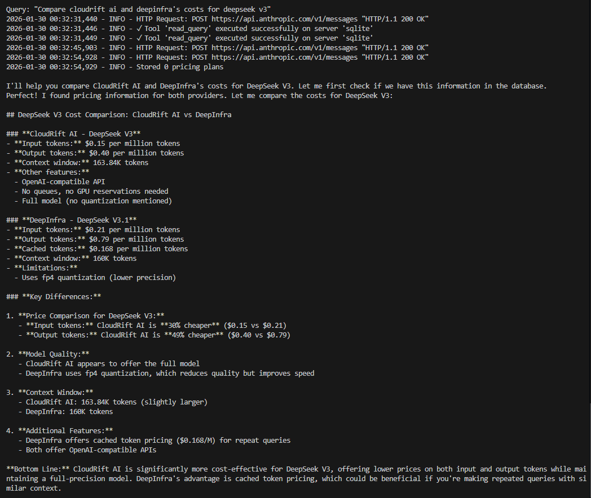
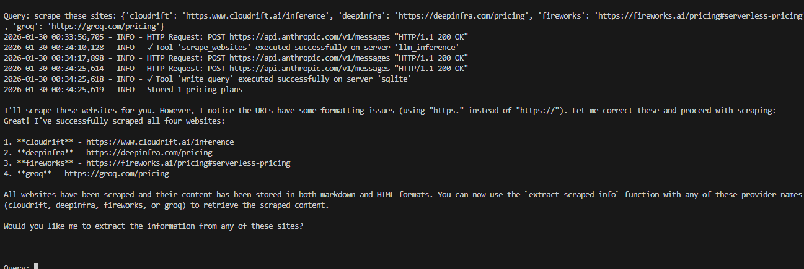
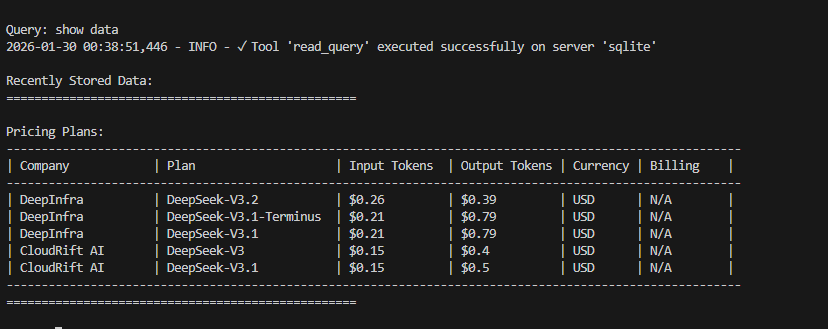

# LLM Pricing Chatbot with MCP Server

## Project Overview

This project is an intelligent chatbot that scrapes and analyzes LLM Inference Serving pricing from various providers. It uses the Model Context Protocol (MCP) architecture to integrate Firecrawl's web scraping API with Claude AI, storing structured pricing data in a SQLite database for efficient querying.

### Key Features

- **Web Scraping**: Automatically scrapes pricing information from major LLM providers using Firecrawl API
- **Intelligent Data Management**: Checks database first before scraping to avoid redundant API calls
- **Structured Data Extraction**: Uses Claude AI to extract and structure pricing information into a database
- **Rate-Limited API Calls**: Implements 4-second delays to prevent rate limit errors
- **Interactive CLI**: Chat-based interface for querying LLM pricing information
- **Multi-Provider Support**: Supports cloudrift, deepinfra, fireworks, and groq pricing sources

### Architecture

- **MCP Server** (`starter_server.py`): Provides tools for scraping websites and extracting content
- **Client** (`starter_client.py`): Orchestrates communication between Claude AI, MCP servers, and SQLite database
- **Model**: Claude 3.5 Haiku for cost-efficient structured data extraction
- **Database**: SQLite for storing pricing plans with company, model, and cost details

## Supported LLM Providers

- **CloudRift**: https://www.cloudrift.ai/inference
- **DeepInfra**: https://deepinfra.com/pricing
- **Fireworks**: https://fireworks.ai/pricing#serverless-pricing
- **Groq**: https://groq.com/pricing

## Setup Instructions

1. Make a venv with uv
2. Sync venv with pyproject.toml (`uv sync`)
3. Make an API Key on Anthropic and Firecrawl
4. Complete the 2 tool calls in `starter_server.py`
5. Change the `server_config.json` to point to your server file
6. Complete any section in `starter_client.py` that has "#complete".
7. Test using any methods taught in the course

## Example Usage

The chatbot intelligently checks the database before scraping. Use prompts like:

- "How much does cloudrift ai (https://www.cloudrift.ai/inference) charge for deepseek v3?"
- "How much does deepinfra (https://deepinfra.com/pricing) charge for deepseek v3"
- "Compare cloudrift ai and deepinfra's costs for deepseek v3"
- Type `show data` to view recently stored pricing information
- Type `quit` to exit

### Example 1: CloudRift AI Pricing Query
**Query:** "How much does cloudrift ai charge for deepseek v3?"



---

### Example 2: DeepInfra Pricing Query
**Query:** "How much does deepinfra charge for deepseek v3"



---

### Example 3: Pricing Comparison
**Query:** "Compare cloudrift ai and deepinfra's costs for deepseek v3"



---

### Example 4: Additional Provider Testing



---

### Example 5: Extended Testing



## Database Schema

```sql
pricing_plans (
    id INTEGER PRIMARY KEY,
    company_name TEXT,
    plan_name TEXT,
    input_tokens REAL,
    output_tokens REAL,
    currency TEXT,
    billing_period TEXT,
    features TEXT (JSON),
    limitations TEXT,
    source_query TEXT,
    created_at DATETIME
)
```

